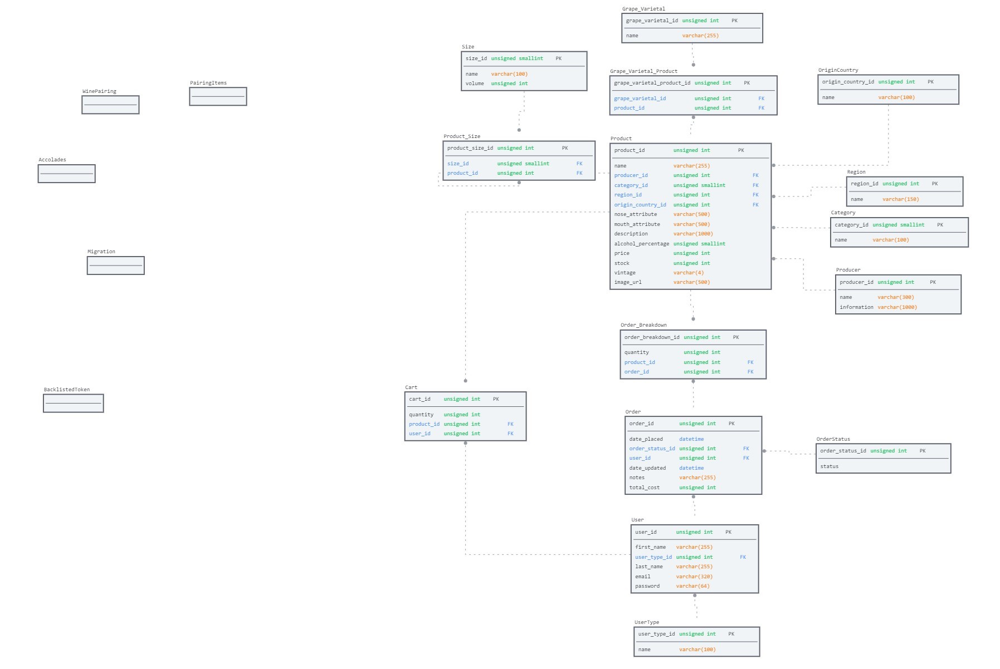
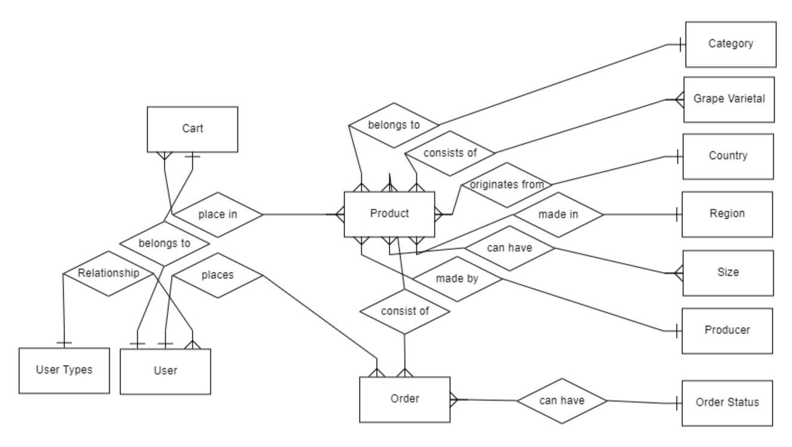

# Project 3 - Backend

[Trent Global College](https://www.trentglobal.edu.sg/)
 * Software Development BootCamp
 * Diploma in Web Application Development
 * Project 3

The front-end repository can be found [here](https://github.com/caracara6/tgc16-p3-fe).

## Context 

Project premise is building a e-commerce store web application framework using Express, Bookshelf, and db-migrate. This is the backend web application which allows admins to do general management and CRUD on the product and order domain. There are also API endpoints called by the front-end.

## Database

### **Logical Schema**


<br>

### **Entity Relationship Diagram (ERD)**


<br>

## Endpoints Documentation

Base API URL: https://cccc-tgc16-p3-api2.herokuapp.com


**PRODUCT DOMAIN**

Get all products:
```
/api/product-related/products
```

Get specific product:
```
/api/product-related/products/:product_id
```

Get all categories:
```
/api/product-related/categories
```

**CART DOMAIN**
Get request - all cart items:
```
/api/cart/
```

Post request - add to cart: 
```
/api/cart/:product_id
```

Put request - update cart: 
```
/api/cart/:product_id
```

Delete request - update cart: 
```
/api/cart/:product_id
```


**CHECKOUT DOMAIN**
Post request - checkout:
```
/api/checkout/
```

Post request - Stripe webhook:
```
/api/checkout/process_payment
```

**USER DOMAIN**
Post request - user register:
```
/api/user/register
```

Post request - user login:
```
/api/user/login
```

Post request - user logout:
```
/api/user/logout
```

Post request - refresh jwt token:
```
/api/user/refresh
```

## Technologies Used

* [Bookshelf.js](https://bookshelfjs.org/)
    * ORM for NodeJs, built on Knex SQL query builder

* [knex](https://github.com/knex/knex)
    * SQL Query Builder for JavaScript

* [Mysql](https://www.mysql.com/)
    * Relational database used by server to store data before deployment

* [Postgres](https://www.postgresql.org/)
    * Relational database used by server to store data after deployment to Heroku

* [Advanced Rest Client](https://install.advancedrestclient.com/install)
    * Test api routes

* [Express](https://expressjs.com/)
    * Web framework for Node.js

* [hbs](https://handlebarsjs.com/)
    * Simple templating language to generate HTML

* [Cloudinary](https://cloudinary.com/)
    * Image hosting service

* [csurf](https://www.npmjs.com/package/csurf)
    * CSRF middleware

* [cors](https://www.npmjs.com/package/cors)
    * NodeJs package to enable CORS

* [JWT Tokens](https://jwt.io/)
    * Signed tokens containing encoded JSON objects

* [Random Key Gen](https://randomkeygen.com/)
    * Provides randomly generated keys and passwords

* [caolan-forms](https://github.com/caolan/forms)
    * Forms modules with built-in helpers

* [dotenv](https://www.npmjs.com/package/dotenv)
    * Storing of environment variables

* [Stripe](https://stripe.com/)
    * Payment gateway